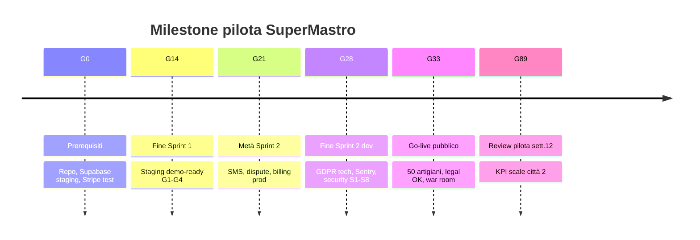
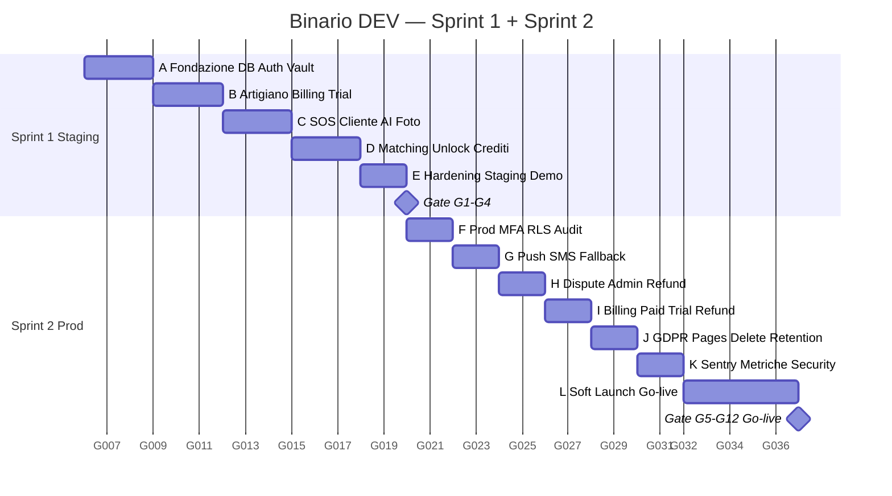
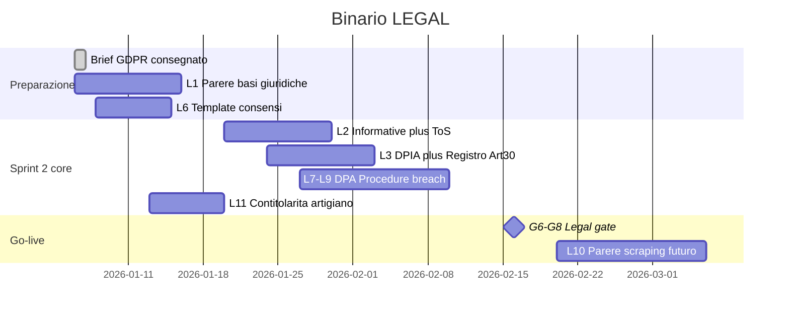
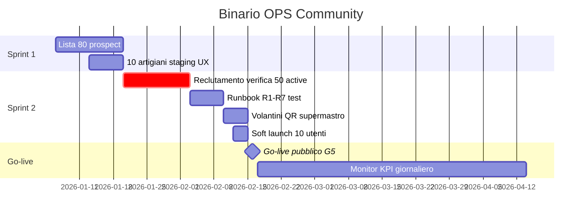

# Gantt unificato Sprint 1 + Sprint 2 — SuperMastro Pilota v1.0

**Progetto:** AncheCasa / SuperMastro  
**Durata totale:** ~33 giorni lavorativi (~6,5 settimane)  
**Riferimenti:** [SPRINT-1](../SPRINT-1-DETTAGLIATO-v1.md) · [SPRINT-2](SPRINT-2-DETTAGLIATO-v1.md) · [INDICE-MASTER](INDICE-MASTER-PILOTA-v1.md)

---

## 1. Panoramica timeline

| Fase | Giorni | Calendario relativo | Milestone |
|------|--------|---------------------|-----------|
| **Giorno 0** | 1 | Setup | Prerequisiti OK |
| **Sprint 1 — Staging** | 14 | G1 → G14 | Gate **G1–G4** · Demo staging |
| **Sprint 2 — Go-live** | 14 | G15 → G28 | Dev prod completo |
| **Soft launch + war room** | 3–5 | G29 → G33 | Gate **G5–G12** · **Go-live pubblico** |
| **Pilota operativo** | +56 | Sett. 7–12 | Gate scale città #2 |

**Go-live pubblico target:** fine **G33** (≈ settimana 7 se partenza G1 = lunedì)

---

## 2. Milestone e gate (vista stakeholder)



| Gate | Quando | Criterio sintetico | Owner |
|------|--------|-------------------|-------|
| **G0** | Pre G1 | Env staging, brief letto | Dev + PO |
| **G1–G4** | G14 | T1–T4, S1–S7, 20 seed, demo | Dev + PO |
| **G5** | G33 | ≥50 artigiani `active` reali | Ops |
| **G6–G8** | G33 | GDPR checklist, privacy, DPIA | Legal |
| **G9–G12** | G33 | SMS, MFA, trial refund, runbook | Dev + Ops |
| **Go-live** | G33 | Tutti gate sopra | PO |
| **Scale** | ~G89 | Match ≥60%, conversion ≥25% | PO |

---

## 3. Gantt DEV unificato (28 giorni + soft launch)



> **Nota date:** il Gantt usa date esemplificative (gennaio 2026). All'avvio reale, imposta **G1 = primo lunedì di sprint** e ricalcola.

---

## 4. Gantt LEGAL (parallelo — sett. 1–7)



**Blocker go-live:** G7 informative live + G8 DPIA + DPA firmati (Supabase, Stripe, SMS, AI).

---

## 5. Gantt OPS (parallelo — sett. 1–7)



**Target pool G5:** 50 artigiani `active` — min 18 idraulico, 18 elettricista, 14 fabbro.

---

## 6. Calendario settimanale unificato

### Settimana 1 (G1–G5) — Fondazione + artigiano inizio

| Binario | Lun–Ven | Deliverable |
|---------|---------|-------------|
| **DEV** | A1–A7, B1 | Supabase staging, vault, auth, profilo artigiano |
| **LEGAL** | L1, L6 | Parere basi giuridiche, template consensi |
| **OPS** | 0.1–0.4 | 40 prospect contattati |

### Settimana 2 (G6–G10) — Artigiano + SOS inizio

| Binario | Lun–Ven | Deliverable |
|---------|---------|-------------|
| **DEV** | B2–B6, C1–C2 | Admin verify, Stripe trial, SOS landing + foto |
| **LEGAL** | L1, L11 | Parere in chiusura, contitolarità artigiano |
| **OPS** | 0.5 | 10 artigiani in staging |

### Settimana 3 (G11–G14) — Matching + staging demo ✓

| Binario | Lun–Ven | Deliverable |
|---------|---------|-------------|
| **DEV** | C3–E6 | AI, matching, unlock, **Gate G1–G4**, demo |
| **LEGAL** | L2 inizio | Bozze informative |
| **OPS** | Feedback UX | Note onboarding |

**🎯 Milestone G14:** Staging demo-ready

---

### Settimana 4 (G15–G19) — Prod + notifiche

| Binario | Lun–Ven | Deliverable |
|---------|---------|-------------|
| **DEV** | F1–F6, G1–G2 | Prod env, MFA, **SMS fallback G9** |
| **LEGAL** | L2, L3 | Informative + DPIA draft |
| **OPS** | Reclutamento | 25 artigiani `active` |

### Settimana 5 (G20–G24) — Dispute + billing

| Binario | Lun–Ven | Deliverable |
|---------|---------|-------------|
| **DEV** | G3–G6, H*, I* | SMS cliente, dispute, pacchetto paid, trial refund job |
| **LEGAL** | L3, L7–L9 | Registro Art.30, DPA, procedure diritti |
| **OPS** | Reclutamento | **40 artigiani `active`** |

### Settimana 6 (G25–G28) — GDPR tech + observability

| Binario | Lun–Ven | Deliverable |
|---------|---------|-------------|
| **DEV** | J*, K* | Privacy pages, delete account, Sentry, **S1–S8** |
| **LEGAL** | G6–G8 prep | Review finale pagine legal |
| **OPS** | Runbook | R1–R7 walkthrough |

**🎯 Milestone G28:** Dev prod-complete

---

### Settimana 7 (G29–G33) — Soft launch + go-live 🚀

| Giorno | DEV | OPS | LEGAL |
|--------|-----|-----|-------|
| G29–G30 | L1–L3 prod seed, soft launch | 50 `active`, 10 utenti friendly | G7 pagine live |
| G31 | Monitor bugfix | Volantini condominio | G8 DPIA ok |
| G32 | War room | Comunicazione lancio | DPA check |
| G33 | **Go-live pubblico L6** | Pool G5 confermato | **Gate G6–G8** |

**🎯 Milestone G33:** Go-live pubblico città pilota

---

### Settimane 8–12 (G34–G89) — Pilota operativo

| Settimana | Focus | KPI review |
|-----------|-------|------------|
| 8–9 | Stabilizzazione, hotfix, ops daily | Match rate, time-to-match |
| 10 | Prima review conversion trial→paid | Churn artigiani |
| 11 | Ottimizzazione pool / seconda ondata manuale | Dispute rate |
| 12 | **Decision gate scale** | GO / ITERATE / STOP |

---

## 7. Percorso critico (critical path)

```mermaid
flowchart LR
    A[A4 Vault RLS] --> B[B4 Stripe webhook]
    B --> C[D3 Accept RPC]
    C --> D[D4 Unlock]
    D --> E[G14 Staging OK]
    E --> F[F1 Prod env]
    F --> G[G2 SMS fallback]
    G --> H[J1 Privacy pages]
    H --> I[Legal G7-G8]
    I --> J[Ops 50 active]
    J --> K[G33 Go-live]
```



**Elementi sul critical path:**

1. Vault + ledger + match RPC (S1)
2. Staging gate G1–G4 (S1)
3. Prod + SMS (S2)
4. Pagine legal definitive (S2 — **non deviabile**)
5. Pool 50 artigiani (S2 — **non deviabile**)

**Fuori critical path (parallellizzabili):** Sentry, win-back email, load test, L10 scraping parere.

---

## 8. Vista per ruolo — cosa fare quando

### Full-stack dev

| Periodo | Focus |
|---------|-------|
| G1–G3 | Blocco A — non procedere senza vault |
| G4–G6 | Blocco B — Stripe webhook giorno 5 |
| G7–G9 | Blocco C — AI + consenso |
| G10–G12 | Blocco D — accept/unlock |
| G13–G14 | Test + demo |
| G15–G16 | Prod + MFA |
| G17–G18 | SMS — **critico go-live** |
| G19–G20 | Dispute + billing |
| G21–G24 | GDPR tech + Sentry |
| G29–G33 | Soft launch + hotfix |

### Product owner

| Quando | Azione |
|--------|--------|
| G0 | Kickoff, CR process, consegna brief legal |
| G7 | Review UX onboarding artigiano |
| G14 | Demo staging, go/no-go S2 |
| G21 | Review copy privacy con legal |
| G28 | Go/no-go go-live |
| G33 | Comunicazione lancio |
| G34+ | KPI settimanali |

### Legal / DPO

| Quando | Deliverable |
|--------|-------------|
| G1–G10 | L1 parere, L6 consensi |
| G15–G28 | L2–L9 informative, DPIA, DPA |
| G33 | Gate G6–G8 — **blocker** |

### Ops locale

| Quando | Target |
|--------|--------|
| G1–G14 | 10 artigiani staging, feedback |
| G15–G28 | 50 artigiani `active` |
| G29–G33 | Soft launch, volantini, runbook |
| G34+ | Monitor match rate daily |

---

## 9. Dipendenze cross-binario

| Evento DEV | Richiede LEGAL | Richiede OPS |
|------------|----------------|--------------|
| C3 consenso AI live | L6 template approvato | — |
| G14 demo staging | — | 10 artigiani test UX |
| J1 privacy pages | L2 testo finale | — |
| G33 go-live | G6–G8 completi | G5 50 active |
| L6 soft launch | G7 bozza ok | 10 friendly users |

**Regola:** go-live G33 = **AND** dev + legal + ops, non OR.

---

## 10. Rischi timeline

| Rischio | Impatto | Slittamento | Mitigazione |
|---------|---------|-------------|-------------|
| Legal ritarda L2 | +1–2 sett. go-live | G33 → G43 | Soft launch friendly only |
| Pool <50 a G28 | Blocker G33 | +1 sett. | Pausa marketing; ops sprint |
| Stripe prod delay | +3–5 gg S2 | G17+ | Stripe CLI staging ok in S1 |
| Bug vault P0 in S2 | Blocker | Stop go-live | S1–S8 regressione G27 |
| Push provider setup | +2–3 gg S1 | G10+ | Setup Firebase G4, non G10 |

---

## 11. Checklist vista calendario — stampabile

```
□ G0  Prerequisiti
□ G3  Gate A — vault test S1
□ G6  Gate B — artigiano T1
□ G9  Gate C — richiesta SOS E2E
□ G12 Gate D — match T2-T4
□ G14 Gate G1-G4 — DEMO STAGING
□ G16 Gate F — MFA prod
□ G18 Gate G — SMS G9
□ G24 Trial refund T6
□ G28 Gate K — Sentry + S1-S8
□ G30 Ops 50 active G5
□ G33 Legal G6-G8
□ G33 GO-LIVE PUBBLICO
□ G89 Review pilota sett.12
```

---

## 12. Documenti collegati

| Documento | Contenuto |
|-----------|-----------|
| [SPRINT-1-DETTAGLIATO-v1.md](../SPRINT-1-DETTAGLIATO-v1.md) | Task A–E, giorni 1–14 |
| [SPRINT-2-DETTAGLIATO-v1.md](SPRINT-2-DETTAGLIATO-v1.md) | Task F–L, giorni 15–33 |
| [INDICE-MASTER-PILOTA-v1.md](INDICE-MASTER-PILOTA-v1.md) | Gate G1–G12, matrice |
| [BRIEF-CONSULENTE-GDPR-v1.md](BRIEF-CONSULENTE-GDPR-v1.md) | Binario legal |
| [02-FLUSSO-OPERATIVO-ARTIGIANO-v1.md](02-FLUSSO-OPERATIVO-ARTIGIANO-v1.md) | Binario ops |

---

## 13. Change log

| Versione | Data | Nota |
|----------|------|------|
| 1.0-pilot | 2026-07-05 | Gantt unificato S1+S2 |

---

*Impostare G1 alla data reale di kickoff e propagare a tutte le milestone.*
