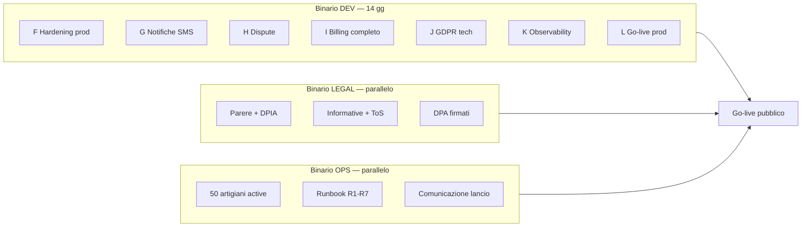
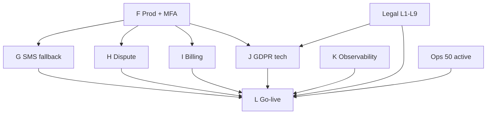

# Sprint 2 — Priorità dev e go-live (dettagliato)

**Progetto:** AncheCasa / SuperMastro  
**Versione:** 1.0-pilot  
**Prerequisito:** [Sprint 1 completato](../SPRINT-1-DETTAGLIATO-v1.md) — staging demo-ready (Gate G1–G4)  
**Durata:** 14 giorni dev + 3–5 giorni soft go-live (parallelo legal/ops)  
**Obiettivo sprint:** **go-live pubblico** città pilota con Gate G5–G12 soddisfatti

**URL canonico go-live:** `anchecasa.it/supermastro` · redirect `/sos` · artigiani `/artigiano`

---

## 1. Obiettivo e non-obiettivi

### Obiettivo (Definition of Done sprint)

1. Produzione live con pool ≥ **50 artigiani `active` reali**
2. Flusso SOS completo in prod: foto → match → unlock → credito −1
3. **SMS fallback** se push non consegnata entro 2 min
4. **Dispute** cliente/artigiano + refund admin
5. **Billing completo:** trial + pacchetto paid + job rimborso trial fine mese
6. **GDPR go-live:** informative pubblicate, consensi, cancellazione account, retention foto
7. **Observability:** Sentry + riconciliazione Stripe notturna
8. **Security:** MFA admin, test S1–S8, runbook ops testato

### Non obiettivi Sprint 2

| Item | Slittare a |
|------|------------|
| B2B dashboard condominio | Fase 3 |
| Scraping CV / supply ingest | Fase 3 (+ parere legale L10) |
| Video diagnosis | v1.1 |
| Chat in-app | v1.1 |
| App nativa iOS/Android | v1.2 |
| Multi-città | Dopo gate sett. 12 |
| Ranking AI shortlist | Dopo KPI pilota |
| PWA install prompt (nice-to-have) | Sprint 3 se tempo |
| Abbonamento Stripe ricorrente auto | v1.1 |
| Seconda ondata inviti **automatica** | Admin manuale ok; auto in v1.1 |

---

## 2. Due binari paralleli

Sprint 2 non è solo dev. **Go-live bloccato** se legal o ops non completano il proprio binario.

| Binario | Owner | Gate |
|---------|-------|------|
| DEV | Full-stack | G9, G11, G12, tech G6 parziale |
| LEGAL | Consulente/DPO | G6, G7, G8 |
| OPS | Community locale | G5, G10 |

---

## 3. Backlog ordinato — 14 task dev (+ go-live)

### 🔴 Blocco F — Production hardening (Giorni 1–2)

| # | Task | Dipende da | DoD |
|---|------|------------|-----|
| **F1** | Ambiente **prod** Supabase + Vercel separato da staging | Sprint 1 | Env prod; secrets distinti; no service role in frontend |
| **F2** | Redirect 301: `/sos` → `/supermastro` (UTM preservati) | F1 | Test curl 301; copy NAMING-COPY rispettato |
| **F3** | Route `/artigiano` produzione (se non in S1) | F1 | Entry point artigiano live |
| **F4** | MFA obbligatorio account admin | F1 | Login admin senza MFA → bloccato |
| **F5** | RLS audit script — verifica `rowsecurity` su ogni tabella | F1 | Report zero tabelle senza RLS |
| **F6** | Migrazione staging → prod schema (no dati test) | F1 | Migrazioni idempotenti documentate |

**Gate F (fine giorno 2):** G11 MFA ok · F5 report pulito.

---

### 🟠 Blocco G — Notifiche affidabili + SMS (Giorni 3–4)

| # | Task | Dipende da | DoD |
|---|------|------------|-----|
| **G1** | Push delivery tracking: `sent_at`, `delivered_at`, `opened_at` | F1 | Log per invitation |
| **G2** | Job fallback: se push non `delivered` entro **2 min** → SMS artigiano | G1 | Test simulato push fail → SMS entro 3 min |
| **G3** | SMS cliente su match (copy §8 NAMING-COPY) | G2 | Body senza PII pre-match su invito artigiano |
| **G4** | Provider SMS (Twilio o equivalente) + DPA in checklist legal | G2 | Invio test numeri reali |
| **G5** | Retry push 1x su fallimento | G1 | No duplicati SMS se push ok al retry |
| **G6** | Admin flag `sms_only_mode` (runbook R3) | G2 | Toggle disabilita push, forza SMS |

**Gate G (fine giorno 4):** G9 SMS fallback operativo · test push+SMS documentato.

---

### 🟡 Blocco H — Dispute e admin ops (Giorni 5–6)

| # | Task | Dipende da | DoD |
|---|------|------------|-----|
| **H1** | UI cliente: segnala no-show entro 48h post-match | F1 | Apre dispute tipo D1 |
| **H2** | UI artigiano: segnala errore categoria entro 2h | F1 | Dispute tipo D2 |
| **H3** | Admin dispute queue: lista, dettaglio, evidenze, risoluzione | H1, H2 | Matrice decisioni Doc 2 §10 |
| **H4** | RPC `admin_refund_credit` → ledger `dispute_refund` + audit | H3 | Max 2/mese/artigiano enforced |
| **H5** | Admin: seconda ondata inviti manuale (10 artigiani) | H3 | Runbook R1 operativo |
| **H6** | Admin: annulla match + refund automatico | H4 | Motivazione obbligatoria ≥ 50 char |
| **H7** | Email/notifica esito dispute a entrambe le parti | H3 | Copy neutro, no blame |

**Gate H (fine giorno 6):** Test T5 dispute pass · Runbook R1, R4 testato da ops.

---

### 🟢 Blocco I — Billing completo (Giorni 7–8)

| # | Task | Dipende da | DoD |
|---|------|------------|-----|
| **I1** | Stripe Checkout **pacchetto paid** (5 crediti) oltre trial | F1 | SKU distinto da trial |
| **I2** | UI artigiano: acquisto pacchetto + storico ledger | I1 | Balance aggiornato post-webhook |
| **I3** | Job **fine mese**: trial refund se 0 match accettati nel mese | I1 | Test T6 pass |
| **I4** | Scadenza crediti trial a fine mese (no rollover) | I3 | Email reminder −3 gg |
| **I5** | Email win-back: 7 gg e 30 gg senza crediti | I2 | Status `verified` a 30 gg |
| **I6** | Job riconciliazione notturna Stripe ↔ ledger | I1 | Alert su mismatch |
| **I7** | Anti-abuse trial: fingerprint carta / telefono hash | I1 | Stesso trial non ripetibile |

**Gate I (fine giorno 8):** G12 test T6 pass · riconciliazione 1 notte senza errori.

---

### 🔵 Blocco J — GDPR tecnico (Giorni 9–10)

| # | Task | Dipende da | DoD |
|---|------|------------|-----|
| **J1** | Pagine statiche: `/supermastro/privacy`, `/termini`, `/cookie` | Legal L2 | Contenuto fornito da legal, non placeholder |
| **J2** | Pagine `/artigiano/privacy`, `/artigiano/termini` | Legal L2 | Distinte da cliente |
| **J3** | Self-service **cancellazione account** (cliente + artigiano) | F1 | Workflow anonimizzazione Doc 2 |
| **J4** | Export dati JSON su richiesta (Art. 15) — endpoint o admin | J3 | Test export completo |
| **J5** | Job retention: cancellazione foto SOS a **90 gg** post-completed | F1 | Storage purge verificato |
| **J6** | Consenso marketing opt-in separato (non pre-spuntato) | J1 | Log in `consent_records` |
| **J7** | Link privacy e consenso AI/GPS — copy da NAMING-COPY §9 | J1 | Checkbox AI separata verificata |
| **J8** | Registro accessi admin a vault (chi ha visto contatti) | F4 | Log query su unlock admin |

**Gate J (fine giorno 10):** G6 tech checklist · G7 pagine live (contenuto legal).

**Nota:** G7/G8 richiedono deliverable legal L1–L5 — dev integra, legal redige.

---

### 🟣 Blocco K — Observability e performance (Giorni 11–12)

| # | Task | Dipende da | DoD |
|---|------|------------|-----|
| **K1** | Sentry frontend + Edge Functions + error boundary SOS | F1 | Alert su error rate > soglia |
| **K2** | Dashboard metriche pilota (admin): richieste, match rate, time-to-match | H3 | KPI § Doc 1 §1.5 visibili |
| **K3** | Alert: webhook Stripe fallito, vault access anomalo, match rate < 30% / 24h | K1, I6 | Notifica email admin |
| **K4** | Load smoke: 20 richieste concurrent staging | F1 | NFR09 throttle ok |
| **K5** | Test security S8 (canale Realtime altrui) + S1–S7 regressione | F5 | Tutti pass in prod config |
| **K6** | Documentazione deploy rollback (1 pagina) | F1 | Rollback testato in staging |

**Gate K (fine giorno 12):** Sentry live · security regressione pass.

---

### ⚫ Blocco L — Go-live produzione (Giorni 13–14)

| # | Task | Dipende da | DoD |
|---|------|------------|-----|
| **L1** | Seed prod: pilot_zone polygon città reale | F1, Ops G5 | Coordinate verificate |
| **L2** | Import 50 artigiani reali `active` (ops + admin verify) | Ops G5 | ≥ 50 in pool geo |
| **L3** | **Soft launch:** 10 richieste reali monitorate (friendly users) | L2, G, H, I | Zero P0 bug |
| **L4** | Runbook R1–R7 walkthrough con ops | Ops G10 | Firmato ok ops |
| **L5** | Comunicazione lancio: volantino QR → `/supermastro` | NAMING-COPY | Materiali stampati |
| **L6** | **Go-live pubblico** — flag `pilot_public=true` | L3, Legal G6–G8 | Landing accessibile |
| **L7** | War room 48h post-launch: monitor ogni 4h | L6 | Log incidenti vuoto o gestiti |

**Gate L (fine giorno 14):** G5–G12 · go-live pubblico.

---

## 4. Binario LEGAL — calendario parallelo

| Settimana | Deliverable | Gate |
|-----------|-------------|------|
| **S2 sett. 1** | L1 parere basi giuridiche · L6 template consensi · L11 contitolarità | Input per J7 |
| **S2 sett. 1–2** | L2 informative cliente + artigiano · L5 ToS · L7 cookie policy | G7 |
| **S2 sett. 2** | L3 DPIA approvata · L4 registro Art. 30 · L8–L9 procedure diritti/breach | G6, G8 |
| **Pre L6** | DPA Supabase, Stripe, SMS, AI firmati | G6 |
| **Post go-live** | L10 parere scraping (non bloccante) | Fase 3 |

**Blocker assoluto go-live:** G7 + G8 + DPA attivi — owner Legal, non Dev.

---

## 5. Binario OPS — calendario parallelo

| Settimana | Attività | Target |
|-----------|----------|--------|
| **S2 sett. 1** | Convertire 20 prospect staging → registrazione reale | 20 `pending_verification` |
| **S2 sett. 1** | Verifica admin + attivazione trial | 15 `active` |
| **S2 sett. 2** | Scalare reclutamento quartieri pilota | **50 `active`** |
| **S2 sett. 2** | Test runbook R1 (seconda ondata), R6 (pool < 30) | G10 |
| **Giorno 13–14** | Soft launch 10 utenti + volantini condominio | G5, L5 |
| **Post L6** | Monitor match rate giornaliero | KPI settimanale |

**Distribuzione skill target (50 artigiani):**

| Skill | Minimo |
|-------|--------|
| Idraulico | 18 |
| Elettricista | 18 |
| Fabbro | 14 |

**Geo:** copertura uniforme pilot_zone — no cluster solo centro.

---

## 6. Allocazione giorno per giorno (1 dev)

| Giorno | Blocco | Output |
|--------|--------|--------|
| **1** | F1, F2, F3 | Prod env + redirect URL |
| **2** | F4, F5, F6 | MFA admin + RLS audit |
| **3** | G1, G5 | Push tracking + retry |
| **4** | G2, G3, G4, G6 | SMS fallback completo |
| **5** | H1, H2 | UI dispute cliente/artigiano |
| **6** | H3, H4, H5, H6, H7 | Admin dispute + refund |
| **7** | I1, I2, I7 | Pacchetto paid + anti-abuse |
| **8** | I3, I4, I5, I6 | Trial refund job + riconciliazione |
| **9** | J1, J2, J6, J7 | Pagine legal (integrazione) |
| **10** | J3, J4, J5, J8 | Cancellazione + retention + export |
| **11** | K1, K2, K3 | Sentry + metriche + alert |
| **12** | K4, K5, K6 | Load + security regressione |
| **13** | L1, L2, L3 | Soft launch |
| **14** | L4, L5, L6, L7 | Go-live + war room |

**Se slittamento:** priorità taglio in ordine inverso — K4 load test → J4 export self-service → I5 win-back email → G5 retry push. **Mai tagliare:** G2 SMS, H4 refund, I3 trial refund, J5 retention, F4 MFA.

---

## 7. Dipendenze critiche

---

## 8. Test obbligatori Sprint 2

| ID | Scenario | Blocco | Gate |
|----|----------|--------|------|
| T6 | Trial refund fine mese, 0 match | I3 | G12 |
| T5 | Dispute no-show → refund credito | H4 | H |
| T7 | SMS fallback push fail | G2 | G9 |
| T8 | Pacchetto paid → +5 ledger | I1 | I |
| T9 | Cancellazione account → anonimizzazione | J3 | G6 |
| T10 | Retention foto 90 gg (simulazione data) | J5 | G6 |
| S1–S8 | Security regressione completa | K5 | Pre L6 |
| E2E | 10 scenari soft launch reali | L3 | L |

---

## 9. Definition of Done — Sprint 2 completo

### Dev

- [ ] Prod live su `anchecasa.it/supermastro`
- [ ] Redirect `/sos` attivo
- [ ] SMS fallback G9
- [ ] MFA admin G11
- [ ] Trial refund T6 / G12
- [ ] Dispute + refund operativi
- [ ] Pacchetto paid Stripe
- [ ] Pagine privacy/termini integrate (contenuto legal)
- [ ] Cancellazione account + retention foto
- [ ] Sentry + riconciliazione Stripe
- [ ] Security S1–S8 pass

### Legal

- [ ] G6 checklist GDPR completa
- [ ] G7 informative pubblicate
- [ ] G8 DPIA approvata
- [ ] DPA sub-responsabili firmati

### Ops

- [ ] G5 ≥ 50 artigiani `active`
- [ ] G10 runbook R1–R7 testato
- [ ] Volantini + soft launch completati

### Business

- [ ] Go-live pubblico (L6)
- [ ] War room 48h senza P0 aperti
- [ ] KPI tracking settimanale attivo

---

## 10. Rischio sprint e mitigazione

| Rischio | Probabilità | Mitigazione |
|---------|:-----------:|-------------|
| Legal ritarda informative | Alta | Soft launch solo friendly users; no ads finché G7 |
| Pool < 50 artigiani | Media | Ritarda L6 max 7 gg; no ads paid |
| SMS costi imprevisti | Bassa | Cap giornaliero SMS; monitor G2 |
| Trial abuse | Media | I7 fingerprint |
| Match rate basso day 1 | Media | Runbook R1 seconda ondata; ops call artigiani |
| Bug vault P0 | Bassa | K5 + no go-live se S1 fail |

---

## 11. Sprint 3 — preview (post go-live, settimane 3–6 pilota)

| Priorità | Item | Trigger |
|:--------:|------|---------|
| 1 | PWA install prompt + offline shell minimo | Dopo 2 sett. stabilità |
| 2 | Seconda ondata inviti **automatica** | Match rate < 50% per 2 sett. |
| 3 | Rating post-intervento (semplice thumbs) | Dopo 100 match |
| 4 | Invito sequenziale (1 artigiano alla volta) | Se spam push segnalato |
| 5 | Dashboard KPI export CSV | Review sett. 4 |
| 6 | Valutazione città #2 | Gate §6.3 indice master |
| 7 | Parere scraping + roadmap supply | Dopo L10 legal |

**Durata suggerita Sprint 3:** 10–14 giorni dev, data-driven da KPI settimana 2–4.

---

## 12. Metriche da monitorare (settimana go-live + 3 sett. dopo)

| Metrica | Frequenza | Azione se sotto soglia |
|---------|-----------|------------------------|
| Match rate | Giornaliera | R1 seconda ondata |
| Time to match | Giornaliera | Ops call artigiani inattivi |
| Push delivery rate | Giornaliera | Debug G1; SMS_only_mode |
| SMS cost / match | Settimanale | Review provider |
| Dispute rate | Settimanale | Review AI categoria |
| Trial → paid conversion | Settimanale | Win-back I5 |
| Error rate Sentry | Realtime | Hotfix |
| Richieste SOS / giorno | Giornaliera | Throttle se > capacity pool |

---

## 13. Collegamenti documentazione

| Documento | Uso in Sprint 2 |
|-------------|-----------------|
| `INDICE-MASTER-PILOTA-v1.md` §6.2 | Gate G5–G12 |
| `BRIEF-CONSULENTE-GDPR-v1.md` §20–21 | Checklist + deliverable legal |
| `NAMING-COPY-SUPERMASTRO-v1.md` | Push, SMS, volantini L5 |
| Doc 2 Flusso artigiano §10 | Matrice dispute H3 |
| Doc 3 Threat model §7 | Checklist security K5 |

---

## 14. Change log

| Versione | Data | Nota |
|----------|------|------|
| 1.0-pilot | 2026-07-05 | Creazione Sprint 2 dettagliato |

---

*Prerequisito: Sprint 1 Gate G1–G4 completati. Modifiche scope via CR (Product Spec §1.6).*
